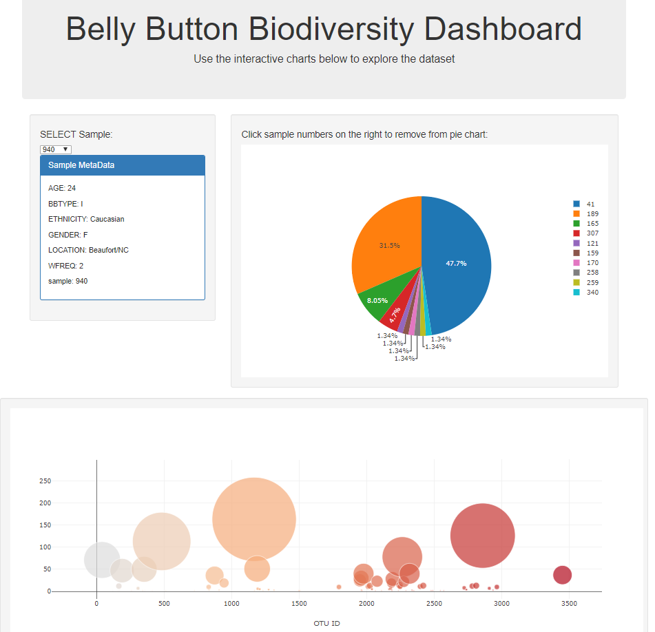

# Belly Button Biodiversity
## Summary
* A homework assignment for UC Berkeley's Data Analytics Bootcamp 
* Visual dashboard of bacterial biodiversity data
* See the deployed application here: https://biodiv-belly-button-app.herokuapp.com/

